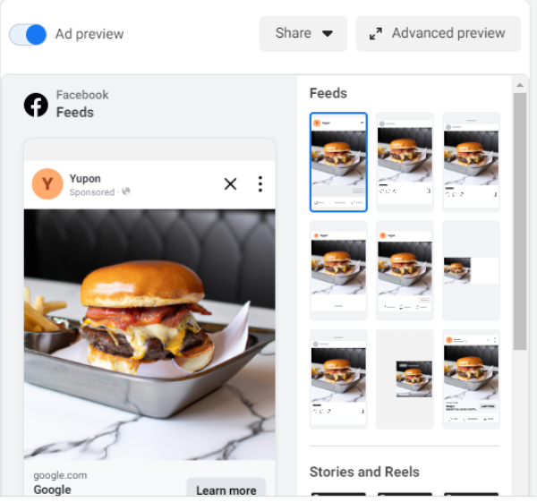

# Yupon AI 
### Team: The Twins
### Members: George Wang, Michael Wang, Jerry Chen (also a twin!)

# Description
Yupon AI is an AI marketing platform for locally-owned restaurants.

It has 2 distinct features:
### 1. Upload a menu to automatically generate a mobile rewards points app.
Restaurants can easily create a mobile ordering/rewards app just by uploading a picture of their menu. Yupon will use Google Cloud Vision's optical character recognition machine learning tool to automatically detect the menu items and generate a loyalty app based on that.

The app allows users to order with money or points and automatically generates the points value system. The app also has search, profile, and history capabilities.

### 2. Generate realistic AI food graphics to automatically start running ads and detect which graphics perform the best, allocating more funds towards those graphics.
Restaurants can easily create Facebook ad campaigns by just providing a budget, promotion, and description of the food. Yupon will use the description to automatically generate a few professional pictures of the food. After that, Yupon integrates with the Meta Marketing/Ads API to start running ads that point to the rewards app. Using machine learning, Yupon can optimize to see which ad performs the best and allocate more funds towards those.

Furthermore, Yupon can detect which placements perform the best (Stories, Reels, Feeds, Messenger), as well as using data on age, demographics, and interests to further optimize ad campaigns.

# Tech Stack
### Web Dashboard for Businesses
-Next.js 13

-Google Cloud Vision OCR

-OpenAI DALL-E API

-Meta/Facebook Ads API

-Auth0

-MongoDB

-Google Cloud Storage

-Tailwind CSS

### Mobile App
-Reactive Native/Expo

-Auth0

-React-Redux
